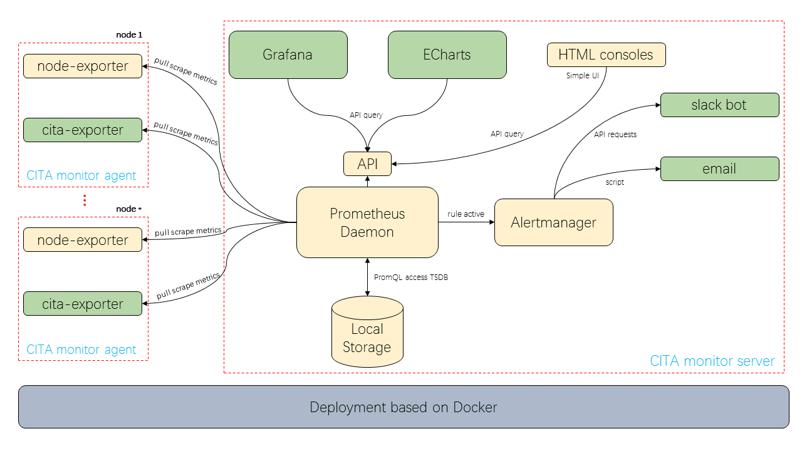

# CITA-Monitor

[EN](README.md) | [CN](README-CN.md)

CITA Monitor 是为监控 [CITA](https://github.com/cryptape/cita) 区块链服务运行状态的开源监控系统。

监控的指标包括节点的出块高度、出块间隔、交易量历史等区块链数据信息、CITA的各微服务进程状态、节点连接数等软件信息、以及服务运行环境的 CPU /存储器/磁盘使用率等主机信息等。制定了数据可视化的面板，节点管理员可轻松了解节点的运行健康状态。还内置了一些关键的告警规则，例如服务进程状态告警，如各微服务、依赖服务进程存活；区块链数据状态告警，如出块高度、出块间隔时间、交易数据的TPS；运行环境状态告警，如磁盘空间不足，经过简单配置收发邮箱即可第一时间收到相关告警邮件。

软件架构：基于 Prometheus 框架开发；使用 Grafana 做可视化面板；使用 Alertmanager 做告警消息分发；架构上分为用于数据存储、信息展示、告警分发的 Server 端；区块链数据、软件进程、运行环境监控指标收集的 Agent 端；各端均使用微服务架构分离功能职责，并使用 Docker Compose 部署方式解决服务的依赖管理，轻松做到一行命令更新、启动服务。

开源协议：本项目使用 Apache 2.0 开源协议，可自由二次开发、闭源商用。

[](https://travis-ci.com/cryptape/cita-monitor)
[](https://github.com/cryptape/cita-monitor/blob/master/LICENSE)


## 仪表板(Dashboard) 截图

Summary Dashboard Demo


CITA Node Info Dashboard Demo


Host Info Dashboard Demo


Rabbitmq Dashboard Demo


## 功能列表

* CITA 服务进程监控
  - CITA 微服务及MQ进程的存活、进程的 CPU、内存使用率、IO
* 区块链数据健康监控
  - 节点出块高度历史、出块时间、出块间隔趋势、Quota、交易量历史、TPS、磁盘占用比例、数据目录大小增长趋势
* 运行环境监控
  - 主机运行环境的系统负载、CPU、内存、磁盘空间使用情况、网络流量、TCP 连接数等
* 故障告警通知
  - [监控告警策略](docs/alert_policies.md)
  - 支持邮件通知、Slack 通知、短信通知（Pro 版）
* 节点网络监控（Pro 版）
  - 连接节点数、网络拓扑、地理位置等
* 鉴源限流（Pro 版）
  - 鉴别请求来源、工具；限制访问来源、频率
* JSONRPC 接口调用分析（Pro 版）
  - 统计分析 RPC 方法的请求时间、请求次数

### 仪表板的监控指标

* Summary Dashboard
  * 各节点最新块高
  * 各节点监控进程存活
  * 各节点 CPU 使用率变化
  * 节点列表
* CITA Node Info Dashboard
  * CITA Meta Data - 链的配置信息，如 Chain Name、创建时间等
  * Chain Info - 链的最新块高、共识节点数、共识节点出块历史趋势
  * Node Info - 选定节点的详细信息，包括区块链数据、运行环境、运行软件信息
* Host Info Dashboard
  * 各节点运行主机的信息，包括系统负载、CPU、内存、硬盘使用率、网络流量
* Process Info Dashboard
  * 节点中 CITA 微服进程的存活历史、CPU、内存、IO 变化历史
* RabbitMQ Dashboard
  * RabbitMQ 服务的存活状态、channels 、consumers、connections、queues 等的变化记录

更细节可查看：[监控指标信息结构](docs/information_architecture.md)

## 入门

这里介绍如何安装 server (数据存储端) 端及 agent 端（数据采集端）。

### 前置条件

本系统需要安装以下软件来运行：

* Docker: [install Docker guide](https://docs.docker.com/install/)
* Python: [install Python guide](https://docs.python-guide.org/starting/installation/)

### 安装

安装 server 服务, 请查看 [server/README.md](server/README.md)

安装 agent 服务, 请查看 [agent/README.md](agent/README.md)

## 系统架构



### 端口默认配置

* CITA-Monitor server
    * Prometheus Alertmanager: 1917
    * Prometheus Console: 1918
    * Grafana: 1919
* CITA-Monitor agent
    * host_exporter：1920
    * process_exporter：1921
    * rabbitmq_exporter：1922
    * cita_exporter：1923 

## 参与贡献

### 报告 Bug

提交 issue: https://github.com/cryptape/cita-monitor/issues/new 

记得声明所使用软件的版本信息（包括监控对象的版本信息）

### 技术栈

查看 [docs/tech_stack.md](docs/tech_stack.md) 来了解开发本系统的所用到的编程语言、框架、工具。

### 获取源码

```
git clone git@github.com:cryptape/cita-monitor.git
```

### 代码风格

#### Coding style for Shell

* coding style guide: [Google Shell Style guide](https://google.github.io/styleguide/shell.xml)
* code formatter: [`shfmt -i 2 -ci`](https://github.com/mvdan/sh#shfmt), vscode extension: shell-format
* linter: [ShellCheck](https://github.com/koalaman/shellcheck), vscode extension: shell-format

#### Coding style for Python

* coding style guide: http://google.github.io/styleguide/pyguide.html
* code formatter: [yapf](https://github.com/google/yapf)
* linter: [pylint](https://www.pylint.org/)

#### Coding style for Docker

* coding style guide: https://github.com/Haufe-Lexware/docker-style-guide
* formatter: https://www.fromlatest.io/
* best-practices: https://docs.docker.com/develop/develop-images/dockerfile_best-practices/

#### Coding style for Makefile

* coding style guide: https://style-guides.readthedocs.io/en/latest/makefile.html
* tutorial: https://makefiletutorial.com/
* conventions: https://www.gnu.org/prep/standards/html_node/Makefile-Conventions.html
* best-practices: https://suva.sh/posts/well-documented-makefiles/

### 运行测试

PENDING: Explain how to run the automated tests for this system

### 提交代码

#### 代码提交流程

[GitHub Flow](https://help.github.com/en/articles/github-flow), [Understanding the GitHub flow](https://guides.github.com/introduction/flow/)

#### git style guide

我们要求遵守 [git-style-guide](https://github.com/agis/git-style-guide) 中的规则来进行分支创建、commit组织、commit消息编写以及合并操作。

## 版本规则

我们遵守 [SemVer](http://semver.org/) 规范来创建软件版本。

## 源码授权

本项目使用 Apache 2.0 授权进行源码分发。

## 致谢

* Prometheus: https://prometheus.io/
* Prometheus node-exporter: https://github.com/prometheus/node_exporter
* Prometheus process-exporter: https://github.com/ncabatoff/process-exporter
* Prometheus rabbitmq-exporter: https://github.com/kbudde/rabbitmq_exporter
* CITA: http://docs.citahub.com
* Docker: https://www.docker.com/
